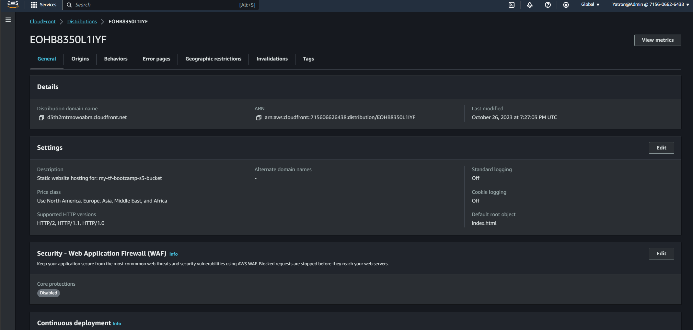

# Terraform Begineer Bootcamp 2023 - week 01

## Fixing Tags

[How to Delete Local and Remote Tags on Git](https://devconnected.com/how-to-delete-local-and-remote-tags-on-git/)

Locall delete a tag
```sh
git tag -d <tag_name>
```

Remotely delete tag

```sh
git push --delete origin tagname
```

Checkout the commit that you want to retag. Grab the sha from your Github history.

```sh
git checkout <SHA>
git tag M.M.P
git push --tags
git checkout main
```

## Root Module Structure

Our root module structure is as follows:
```
PROJECT_ROOT
│
├── main.tf                 # everything else.
├── variables.tf            # stores the structure of input variables
├── terraform.tfvars        # the data of variables we want to load into our terraform project
├── providers.tf            # defined required providers and their configuration
├── outputs.tf              # stores our outputs
└── README.md               # required for root modules
```

[Standard Module Structure](https://developer.hashicorp.com/terraform/language/modules/develop/structure)


## Terraform cloud Variables

I terraform we can set two kind of vars:
- Env vars - those are AWS creds
- Tf vars - those are tf uuid

### Loading Terraform Input Variables

[Terraform Input Variables](https://developer.hashicorp.com/terraform/language/values/variables)

### var flag
We can use the `-var` flag to set an input variable or override a variable in the tfvars file eg. `terraform -var user_ud="my-user_id"`

### var-file flag

- TODO: document this flag

### terraform.tvfars

This is the default file to load in terraform variables in blunk

### auto.tfvars

- TODO: document this functionality for terraform cloud

### order of terraform variables

- TODO: document which terraform variables takes presendence.

- [Error](https://github.com/Yatheesh-Nagella/terraform-beginner-bootcamp-2023/issues/19)

## Dealing With Configuration Drift

## What happens if we lose our state file?

If you lose your statefile, you most likley have to tear down all your cloud infrastructure manually.

You can use terraform port but it won't for all cloud resources. You need check the terraform providers documentation for which resources support import.

### Fix Missing Resources with Terraform Import

`terraform state rm aws_s3_bucket.example`

`terraform import aws_s3_bucket.bucket bucket-name`

[Terraform Import](https://developer.hashicorp.com/terraform/cli/import)
[AWS S3 Bucket Import](https://registry.terraform.io/providers/hashicorp/aws/latest/docs/resources/s3_bucket#import)

### Fix Manual Configuration

If someone goes and delete or modifies cloud resource manually through ClickOps. 

If we run Terraform plan is with attempt to put our infrstraucture back into the expected state fixing Configuration Drift

## Fix using Terraform Refresh

```sh
terraform apply -refresh-only -auto-approve
```

## Terraform Modules

### Terraform Module Structure

It is recommend to place modules in a `modules` directory when locally developing modules but you can name it whatever you like.

### Passing Input Variables

We can pass input variables to our module.
The module has to declare the terraform variables in its own variables.tf

```tf
module "terrahouse_aws" {
  source = "./modules/terrahouse_aws"
  user_uuid = var.user_uuid
  bucket_name = var.bucket_name
}
```

### Modules Sources

Using the source we can import the module from various places eg:
- locally
- Github
- Terraform Registry

```tf
module "terrahouse_aws" {
  source = "./modules/terrahouse_aws"
}
```


[Modules Sources](https://developer.hashicorp.com/terraform/language/modules/sources)


## Considerations when using ChatGPT to write Terraform

LLMs such as ChatGPT may not be trained on the latest documentation or information about Terraform.

It may likely produce older examples that could be deprecated. Often affecting providers.

## Working with Files in Terraform


### Fileexists function

This is a built in terraform function to check the existance of a file.

```tf
condition = fileexists(var.error_html_filepath)
```

https://developer.hashicorp.com/terraform/language/functions/fileexists

### Filemd5

https://developer.hashicorp.com/terraform/language/functions/filemd5

### Path Variable

In terraform there is a special variable called `path` that allows us to reference local paths:
- path.module = get the path for the current module
- path.root = get the path for the root module
[Special Path Variable](https://developer.hashicorp.com/terraform/language/expressions/references#filesystem-and-workspace-info)

```tf
resource "aws_s3_object" "index_html" {
  bucket = aws_s3_bucket.website_bucket.bucket
  key    = "index.html"
  source = "${path.root}/public/index.html"
}
```

## Terraform Locals

Locals allows us to define local variables.
It can be very useful when we need transform data into another format and have referenced a varaible.

```tf
locals {
  s3_origin_id = "MyS3Origin"
}
```
[Local Values](https://developer.hashicorp.com/terraform/language/values/locals)

## Terraform Data Sources

This allows use to source data from cloud resources.

This is useful when we want to reference cloud resources without importing them.

```tf
data "aws_caller_identity" "current" {}

output "account_id" {
  value = data.aws_caller_identity.current.account_id
}
```
[Data Sources](https://developer.hashicorp.com/terraform/language/data-sources)

## Working with JSON

We use the jsonencode to create the json policy inline in the hcl.

```tf
> jsonencode({"hello"="world"})
{"hello":"world"}
```

[jsonencode](https://developer.hashicorp.com/terraform/language/functions/jsonencode)

### AWS Infra SS
- CFN 

- S3-bucket-objects 

### Changine the lifecycle 